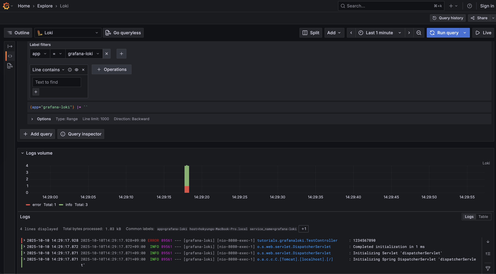

# Grafana Loki

## 1. Grafana Loki 란?
- Prometheus에서 영감을 받은 수평 확장성, 고가용성, 멀티 테넌트 로그 수집 시스템
- 비용적으로 매우 효율적이고 작동하기 쉬운 방식으로 설계됨
- 로그의 내용을 인덱싱하지 않고 각 로그 스트림에 대한 레이블 세트를 인덱싱

## 2. Spring Boot 로그를 loki 로 전송하는 방법
- https://grafana.com/docs/loki/latest/send-data/

### 2.1. Promtail
- 로그를 수집하는 에이전트로 로그를 수집해 Loki로 로그를 전송하는 역할
- [현재 2025.02.13부터 LTS로 전환](https://grafana.com/docs/loki/latest/send-data/promtail/)
```text
Promtail is now deprecated and will enter into Long-Term Support (LTS) beginning Feb. 13, 2025.
This means that Promtail will no longer receive any new feature updates,
but it will receive critical bug fixes and security fixes.
Commercial support will end after the LTS phase,
which we anticipate will extend for about 12 months until February 28, 2026.
End-of-Life (EOL) phase for Promtail will begin once LTS ends.
Promtail is expected to reach EOL on March 2, 2026, afterwards no future support or updates will be provided.
All future feature development will occur in Grafana Alloy.

If you are currently using Promtail, you should plan your migration to Alloy.
The Alloy migration documentation includes a migration tool for converting your Promtail configuration to an Alloy configuration with a single command.
```

### 2.2. Docker driver client
- https://grafana.com/docs/loki/latest/send-data/docker-driver/

### 2.3. loki-logback-appender
- https://github.com/loki4j/loki-logback-appender


## 3. [Install with Docker Compose](https://grafana.com/docs/loki/latest/setup/install/docker/#install-with-docker-compose)
```shell
$ mkdir loki
$ cd loki

$ wget https://raw.githubusercontent.com/grafana/loki/v3.4.1/production/docker-compose.yaml -O docker-compose.yaml

$ docker-compose up -d

<<<
[+] Running 4/4
✔ Network loki_loki          Created 
✔ Container loki-loki-1      Started              0.0s
✔ Container loki-grafana-1   Started              0.0s
✔ Container loki-promtail-1  Started              0.0s
```
- [Grafana 접속](http://localhost:3000/)



## 4. Loki4j configuration

### 4.1. [Old Docs](https://loki4j.github.io/loki-logback-appender/docs/olddocs)
- v1.6.0
  ```xml
  <appender name="LOKI" class="com.github.loki4j.logback.Loki4jAppender">
      <batchMaxItems>100</batchMaxItems>
      <batchTimeoutMs>10000</batchTimeoutMs>
      <verbose>true</verbose>
      <http class="com.github.loki4j.logback.ApacheHttpSender">
          <url>http://localhost:3100/loki/api/v1/push</url>
          <requestTimeoutMs>10000</requestTimeoutMs>
      </http>
      <format class="com.github.loki4j.logback.ProtobufEncoder">
          <label>
              <pattern>app:my-app,host:${HOSTNAME}</pattern>
              <keyValueSeparator>:</keyValueSeparator>
          </label>
          <message class="com.github.loki4j.logback.JsonLayout">
              <timestamp>
                  <enabled>false</enabled>
              </timestamp>
              <loggerName>
                  <targetLength>20</targetLength>
              </loggerName>
          </message>
          <sortByTime>true</sortByTime>
      </format>
  </appender>
  ```

### 4.2. [2.x](https://loki4j.github.io/loki-logback-appender/docs/configuration)
- v2.0.0
  ```xml
  <appender name="LOKI" class="com.github.loki4j.logback.Loki4jAppender">
      <labels>
          app = my-app
          host = ${HOSTNAME}
      </labels>
      <structuredMetadata>off</structuredMetadata>
      <message>
          <pattern>%-5level [%thread] %logger{20} - %msg%n</pattern>
      </message>
      <http>
          <url>http://localhost:3100/loki/api/v1/push</url>
          <requestTimeoutMs>10000</requestTimeoutMs>
      </http>
      <batch>
          <maxItems>100</maxItems>
          <timeoutMs>10000</timeoutMs>
      </batch>
      <verbose>true</verbose>
  </appender>
  ```

## 참고
- csh0034 github
  - [README.md](https://github.com/csh0034/tutorials-kotlin/blob/main/grafana-loki/README.md)
  - [README2.md](https://github.com/csh0034/tutorials-kotlin/blob/main/grafana-loki/README2.md)
