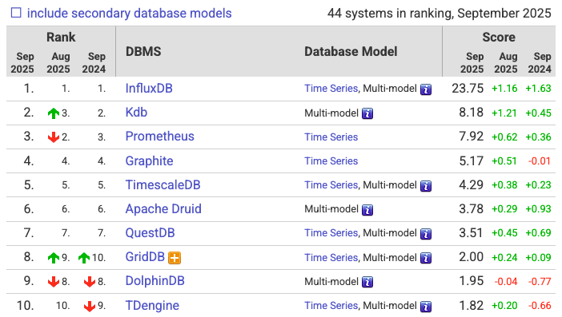
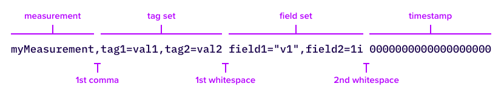

# [InfluxDB](https://www.influxdata.com/)

## 1. InfluxDB란?
- 시계열 데이터베이스(TSDB, Time-series Database)로, 시간과 함께 변화하는 데이터를 효율적으로 저장하고 처리하는데 특화된 데이터베이스

### 1.1 [DB-Engines Ranking of Time Series DBMS](https://db-engines.com/en/ranking/time+series+dbms)
- 2025.09 기준
- 


## 2. 주요 특징

### 2.1. 구조
- 타임스탬프(timestamp): 데이터 생성 시각
- 태그(tag): 인덱싱되는 메타 데이터로, 데이터 검색 및 필터링에 사용
- 필드(field): 실제 데이터 자체
#### RDBMS vs InfluxDB
| RDBMS            | InfluxDB    |
|------------------|-------------|
| Database         | Bucket      |
| Table            | Measurement |
| Indexed Column   | Tag Key     |
| UnIndexed Column | Field Key   |

### 2.2. 고성능 및 확장성
- 대량의 데이터를 빠르게 읽고 쓸 수 있도록 설계
- 시계열 데이터의 특성상 쓰기 작업이 많은데, 이를 효율적으로 처리하기 위해 [LSM-tree](docs/lsm-tree.md)와 유사한 구조를 사용
- 클러스터링을 통해 수평 확장 가능

### 2.3. Query
- [InfluxQL](https://docs.influxdata.com/influxdb/v2/query-data/influxql/): SQL과 유사한 쿼리 언어로, 사용자가 쉽게 접근할 수 있음
- [Flux](https://docs.influxdata.com/influxdb/v2/query-data/flux/): 더 강력하고 유연한 스크립팅 언어로, 데이터 변환, 처리, 다른 데이터 소스와의 결합 등 복잡한 작업을 수행
- [SQL](https://docs.influxdata.com/influxdb3/core/query-data/sql/): InfluxDB 3 버전부터 표준 SQL 지원

### 2.4. DBRP (DataBase and Retention Policy)
- 설정한 시간이 지난 데이터를 자동으로 만료(삭제)시켜주는 정책
- Bucket 단위로 설정


## 3. 데이터 구조

### 3.1. [Line protocol](https://docs.influxdata.com/influxdb/v2/get-started/write/#line-protocol-element-parsing)


#### timestamp
- 모든 데이터들은 timestamp를 저장하고 있는 `_time`이라는 컬럼을 가짐
- microseconds 단위 (변경 가능)

#### Tag Key
- 인덱싱된 컬럼
- 무조건 String 타입

#### Field Key
- 인덱싱되지 않은 일반 컬럼
- 하나의 measurement에 하나 이상의 Field Key 필요
- Float, Integer, String Boolean 타입 가능


## 4. [Install by Docker Compose](https://hub.docker.com/_/influxdb)

### 4.1. [InfluxDB 2](compose.yml)
```yaml
services:
  influxdb:
    container_name: influxdb2
    image: influxdb:2.7
    ports:
      - "8086:8086"
    environment:
      - DOCKER_INFLUXDB_INIT_MODE=setup
      - DOCKER_INFLUXDB_INIT_USERNAME=admin
      - DOCKER_INFLUXDB_INIT_PASSWORD=11111111
      - DOCKER_INFLUXDB_INIT_ORG=ActionsOverWords
      - DOCKER_INFLUXDB_INIT_BUCKET=tutorials
      - DOCKER_INFLUXDB_INIT_RETENTION=1h
      - DOCKER_INFLUXDB_INIT_ADMIN_TOKEN=actionsoverwords
    volumes:
      - influxdb2_data:/var/lib/influxdb2
      - influxdb2_config:/etc/influxdb2
volumes:
  influxdb2_data:
  influxdb2_config:
```

### 4.2. [InfluxDB 3](https://hub.docker.com/_/influxdb)
```yaml
name: influxdb3
services:
  influxdb3-core:
    container_name: influxdb3-core
    image: influxdb:3.4.2-core
    ports:
      - 8181:8181
    command:
      - influxdb3
      - serve
      - --node-id=node0
      - --object-store=file
      - --data-dir=/var/lib/influxdb3/data
      - --plugin-dir=/var/lib/influxdb3/plugins
```
- volumes mount 시 에러
```text
$ docker logs -n 100 influxdb3
2025-09-15T01:22:15.689879Z  INFO influxdb3_lib::commands::serve: InfluxDB 3 Core server starting node_id=node0 git_hash=571299afed3644c69811df9a71816446af64dec0 version=3.4.2 uuid=d965a83d-28a0-4058-b783-59835f376213 num_cpus=4
2025-09-15T01:22:15.690107Z  INFO influxdb3_clap_blocks::object_store: Object Store db_dir="/var/lib/influxdb3/data" object_store_type="Directory"
2025-09-15T01:22:15.690363Z  INFO influxdb3_lib::commands::serve: Creating shared query executor num_threads=4
2025-09-15T01:22:15.731975Z  INFO influxdb3_catalog::object_store::versions::v2: catalog not found, creating a new one catalog_uuid=8e720d94-7602-4581-90f4-114f939e4b18
2025-09-15T01:22:15.732936Z ERROR influxdb3_catalog::object_store::versions::v2: failed to persist catalog checkpoint file error=Generic { store: "LocalFileSystem", source: UnableToCreateDir { source: Os { code: 13, kind: PermissionDenied, message: "Permission denied" }, path: "/var/lib/influxdb3/data/node0/catalog/v2" } }
2025-09-15T01:22:15.733417Z  WARN executor: DedicatedExecutor dropped without calling shutdown()
2025-09-15T01:22:15.733427Z  WARN executor: DedicatedExecutor dropped without waiting for worker termination
2025-09-15T01:22:15.733878Z  WARN executor: DedicatedExecutor dropped without calling shutdown()
2025-09-15T01:22:15.733896Z  WARN executor: DedicatedExecutor dropped without waiting for worker termination
2025-09-15T01:22:15.734209Z  INFO influxdb3_cache::parquet_cache: cache request handler closed
Serve command failed: failed to initialize catalog: object store error: ObjectStore(Generic { store: "LocalFileSystem", source: UnableToCreateDir { source: Os { code: 13, kind: PermissionDenied, message: "Permission denied" }, path: "/var/lib/influxdb3/data/node0/catalog/v2" } })
❯ 
```


## 5. [Using libraries](https://docs.influxdata.com/influxdb/v2/api-guide/client-libraries/)

### 5.1 [org.influxdb:influxdb-java](https://github.com/influxdata/influxdb-java)
- 구 버전 lib
- 해당 버전 사용 시 unauthorized 에러 발생

### 5.2 com.influxdb:influxdb-client-java
- [com.influxdb:influxdb-client-java](https://github.com/influxdata/influxdb-client-java)
- [com.influxdb:flux-dsl](https://github.com/influxdata/influxdb-client-java/tree/master/flux-dsl)
    - Flux dsl 지원
    - query 쉽게 작성
- [com.influxdb:influxdb-client-reactive](https://github.com/influxdata/influxdb-client-java/tree/master/client-reactive)
    - support reactive
- [sample code](https://github.com/influxdata/influxdb-client-java/tree/master/examples/src/main/java/example)
    - GitHub에 정리 잘되어 있음

### 5.3. Integration with spring framework
- 아직까지 없음
- [spring-data-influxdb](https://github.com/miwurster/spring-data-influxdb)
    - 공식 lib 아님
    - 개인이 만들어 버전업이 늦고 InfluxDB에서 잘 만들어놔서 필요성이 적어보임

## 6. Kick
### `in`절 속도 개선
- sql과 다르게 `or`가 빠름
