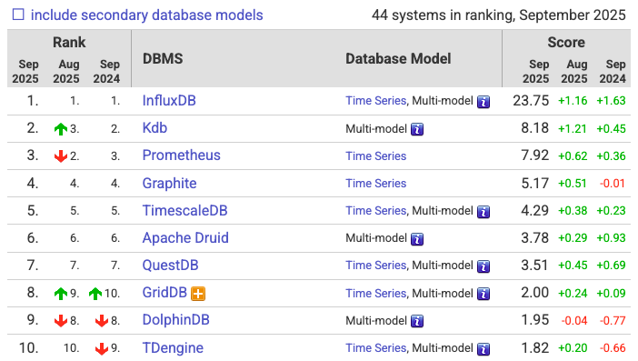
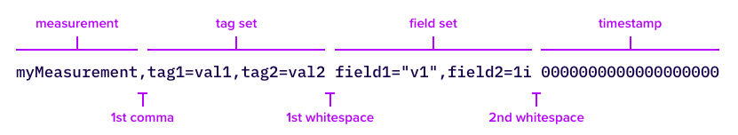

# [InfluxDB](https://www.influxdata.com/)

## 1. InfluxDB란?
- 시계열 데이터베이스(TSDB, Time-series Database)로, 시간과 함께 변화하는 데이터를 효율적으로 저장하고 처리하는데 특화된 데이터베이스

### 1.1 [DB-Engines Ranking of Time Series DBMS](https://db-engines.com/en/ranking/time+series+dbms)
- 2025.09 기준
- 


## 2. 주요 특징

### 2.1. 구조
- 타임스탬프(timestamp): 데이터 생성 시각
- 태그(tag): 인덱싱되는 메타 데이터로, 데이터 검색 및 필터링에 사용
- 필드(field): 실제 데이터 자체
#### RDBMS vs InfluxDB
| RDBMS            | InfluxDB    |
|------------------|-------------|
| Database         | Bucket      |
| Table            | Measurement |
| Indexed Column   | Tag Key     |
| UnIndexed Column | Field Key   |

### 2.2. 고성능 및 확장성
- 대량의 데이터를 빠르게 읽고 쓸 수 있도록 설계
- 시계열 데이터의 특성상 쓰기 작업이 많은데, 이를 효율적으로 처리하기 위해 [LSM-tree](docs/lsm-tree.md)와 유사한 구조를 사용
- 클러스터링을 통해 수평 확장 가능

### 2.3. Query
- [InfluxQL](https://docs.influxdata.com/influxdb/v2/query-data/influxql/): SQL과 유사한 쿼리 언어로, 사용자가 쉽게 접근할 수 있음
- [Flux](https://docs.influxdata.com/influxdb/v2/query-data/flux/): 더 강력하고 유연한 스크립팅 언어로, 데이터 변환, 처리, 다른 데이터 소스와의 결합 등 복잡한 작업을 수행
- [SQL](https://docs.influxdata.com/influxdb3/core/query-data/sql/): InfluxDB 3 버전부터 표준 SQL 지원

### 2.4. DBRP (DataBase and Retention Policy)
- 설정한 시간이 지난 데이터를 자동으로 만료(삭제)시켜주는 정책
- Bucket 단위로 설정


## 3. 데이터 구조

### 3.1. [Line protocol](https://docs.influxdata.com/influxdb/v2/get-started/write/#line-protocol-element-parsing)


#### timestamp
- 모든 데이터들은 timestamp를 저장하고 있는 `_time`이라는 컬럼을 가짐
- microseconds 단위 (변경 가능)

#### Tag Key
- 인덱싱된 컬럼
- 무조건 String 타입

#### Field Key
- 인덱싱되지 않은 일반 컬럼
- 하나의 measurement에 하나 이상의 Field Key 필요
- Float, Integer, String Boolean 타입 가능


## 4. [Install by Docker Compose](https://hub.docker.com/_/influxdb)

### 4.1. [InfluxDB 2](compose.yml)
```yaml
services:
  influxdb:
    container_name: influxdb2
    image: influxdb:2.7
    ports:
      - "8086:8086"
    environment:
      - DOCKER_INFLUXDB_INIT_MODE=setup
      - DOCKER_INFLUXDB_INIT_USERNAME=admin
      - DOCKER_INFLUXDB_INIT_PASSWORD=11111111
      - DOCKER_INFLUXDB_INIT_ORG=ActionsOverWords
      - DOCKER_INFLUXDB_INIT_BUCKET=tutorials
      - DOCKER_INFLUXDB_INIT_RETENTION=1h
      - DOCKER_INFLUXDB_INIT_ADMIN_TOKEN=actionsoverwords
    volumes:
      - influxdb2_data:/var/lib/influxdb2
      - influxdb2_config:/etc/influxdb2
volumes:
  influxdb2_data:
  influxdb2_config:
```

### 4.2. InfluxDB 3
```yaml
name: influxdb3
services:
  influxdb3-core:
    container_name: influxdb3-core
    image: influxdb:3-core
    ports:
      - 8181:8181
    command:
      - influxdb3
      - serve
      - --node-id=node0
      - --object-store=file
      - --data-dir=/var/lib/influxdb3/data
      - --plugin-dir=/var/lib/influxdb3/plugins
    volumes:
      - type: bind
        source: $PWD/influxdb3/core/data
        target: /var/lib/influxdb3/data
      - type: bind
        source: $PWD/influxdb3/core/plugins
        target: /var/lib/influxdb3/plugins

```
