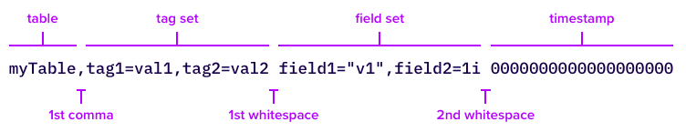

# [InfluxDB 3 Core](https://docs.influxdata.com/influxdb3/core/)

## 1. InfluxDB 3
- 기존 버전(v2)과 비교하여 아키텍처부터 성능, 쿼리 언어에 이르기까지 대대적인 변화

## 2. 특징
- 가장 큰 특징은 고성능, 고압축, 그리고 분석의 유연성으로 요약

### 2.1. Rust 기반의 새로운 아키텍처
- Go 언어로 작성되었던 이전 버전과 달리, v3는 Rust 언어로 재작성. 메모리 안정성을 높이고 더 빠른 성능을 구현

### 2.2. Apache Arrow 기반의 FDAP 스택
- 핵심 엔진으로 FDAP(Flight, DataFusion, Arrow, Parquet) 스택을 채택
#### Apache Arrow
- 인메모리 컬럼형 데이터 형식으로, 데이터 처리 속도를 획기적으로 향상
#### Apache Parquet
- 컬럼 기반의 파일 형식으로, 데이터를 효율적으로 압축하여 저장 공간을 크게 절약
#### Apache DataFusion
- Arrow 기반의 쿼리 엔진으로, SQL 및 InfluxQL 쿼리를 빠르게 처리
#### Apache Arrow Flight
- 빠른 데이터 전송을 위한 프레임워크

### 2.3. 무제한 카디널리티(Unlimited Cardinality)
- 이전 버전의 가장 큰 제약 중 하나였던 높은 카디널리티(태그의 고유한 조합 수) 문제를 해결
- 수십억 개의 시계열 데이터를 성능 저하 없이 처리할 수 있음

### 2.4. SQL 및 InfluxQL 동시 지원
- v2에서 주력으로 내세웠던 Flux 언어와 함께, 사용자에게 친숙한 SQL과 기존의 InfluxQL을 기본적으로 지원
- 데이터 분석가와 개발자 모두가 쉽게 데이터를 쿼리하고 활용

### 2.5. 저비용 객체 스토리지 활용
- 데이터를 Parquet 파일 형식으로 Amazon S3와 같은 저렴한 객체 스토리지에 저장하여 비용 효율성을 극대화

### 2.6. 빌트인 Python 처리 엔진
- 데이터베이스 내에서 직접 Python 코드를 실행하여 데이터 변환, 보강, 알림 등의 작업을 수행할 수 있음
- 이는 외부 ETL 파이프라인의 필요성을 줄여줌


## 3. 데이터 구조

### 3.1. LineProtocol

- V2의 `measurement`와 V3의 `table` 의미가 동일함

### 3.2. InfluxDB2 vs InfluxDB3
| InfluxDB 2  | InfluxDB 3              |
|-------------|-------------------------|
| Bucket      | Database (or Namespace) |
| Measurement | Table (Measurement)     |
| Tag         | Tag (Column)            |
| Field       | Field (Column)          |


## 4. [Install by Docker Compose](https://hub.docker.com/_/influxdb)
### 4.1. [InfluxDB 3](https://hub.docker.com/_/influxdb)
```yaml
name: influxdb3
services:
  influxdb3-core:
    container_name: influxdb3-core
    image: influxdb:3.4.2-core
    ports:
      - 8181:8181
    command:
      - influxdb3
      - serve
      - --node-id=node0
      - --object-store=file
      - --data-dir=/var/lib/influxdb3/data
      - --plugin-dir=/var/lib/influxdb3/plugins
```

### 4.2. [Create token](https://docs.influxdata.com/influxdb3/core/get-started/setup/#set-up-authorization)
```shell
$ influxdb3 create token --admin

// docker
$ docker exec -it [CONTAINER_NAME] influxdb3 create token --admin
```

## 5. [Using libraries](https://docs.influxdata.com/influxdb3/core/write-data/client-libraries/)

### 5.1 [InfluxDB 3 Java Client](https://github.com/InfluxCommunity/influxdb3-java)
- 공식 지원 lib

## 6. Kick
- java.lang.reflect.InaccessibleObjectException: Unable to make field long java.nio.Buffer.address accessible: module java.base does not "opens java.nio" to unnamed module @2d6e8792
  - Add VM Option: `--add-opens java.base/java.nio=ALL-UNNAMED --add-opens java.base/sun.nio.ch=ALL-UNNAMED`
  ```groovy
  // build.gradle.kt
  jvmArgs(
    "--add-opens", "java.base/java.nio=ALL-UNNAMED",
    "--add-opens", "java.base/sun.nio.ch=ALL-UNNAMED"
  )
  ```
  ```kotlin
  return influxDBClient.query(query)
    .sequential()
    .map { record ->
      objectMapper.convertValue(record, CpuUsageQueryResponse::class.java)
    }
    .toList()
  ```

- Memory leaked
  - `try-with-resources`로 자원 해제해야 함
  - Invocation of close method failed on bean with name 'influxDBClient': java.lang.IllegalStateException: Memory was leaked by query. Memory leaked: (PID)
```kotlin
return influxDBClient.queryRows(query)
  .use {
    it.asSequence()
      .map { record ->
        CpuUsageQueryResponse.fromRecord(record)
      }
      .toList()
  }
```

## 7. TODO
- [Testcontainers](src/test/kotlin/tutorials/influxdb3/config/InfluxDB3TestContainerConfig.kt) 실행 방법 못 찾음
> 날짜 검색, 페이징 처리 등 조금 더 개선 필요
