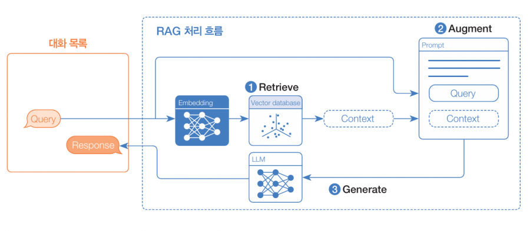

# [Spring AI](https://docs.spring.io/spring-ai/reference/index.html)

## 프롬프트 엔지니어링 (Prompt Engineering)

### 제로 샷 프롬프트
- 예시 없이 작업을 수행하도록 요청

### 슈 샷 프롬프트
- 몇 개의 예시를 제공하여 원하는 출력 방식으로 출력을 유도하는 기법

### 역할 부여 프롬프트
- 특정 역할을 부여함으로써 출력 내용의 스타일, 톤, 깊이를 조정하는 기법

### 스템 백 프롬프트
- 복잡한 질문을 여러 단계로 분해해, 단계별로 배경 지식을 확보하는 기법

### CoT (Chain of Thought)
- 논리적인 단계로 생각하도록 요구함으로써 다단계 추론이 필요한 작업에서 성능을 향상시키는 기법

## Advisor
- Application과 LLM 간의 상호 작용을 가로채어, LLM에게 전달되는 프롬프르를 강화하거나 응답을 변환

### Embedding Advisor
- SimpleLoggerAdvisor, SafeGuardAdvisor, ChatMemory (MessageChatMemoryAdvisor, PromptChatMemoryAdvisor, ...) 등

## Embedding
- 텍스트나 이미지와 같은 데이터를 부동 소숫점으로 이루어진 벡터로 변환하는 과정

### 데이터를 벡터로 변환하는 이유
- 벡터가 방향과 크기를 갖는 다차원 공간의 한 점으로 표현될 수 있기 때문
- 벡터화된 두개의 데이터는 방향과 크기가 비슷할수록 데이터간 유사도가 높음

## ChatMemory

### MessageChatMemoryAdvisor
- ChatMemory에서 받은 대화 기억을 `사용자 메시지(User Message)`와 AI 메시지(AssistantMessage)들로 생성

### PromptChatMemoryAdvisor
- ChatMemory로부터 받은 대화 기억을 `시스템 메시지(System Message`에 포함

### ETC
### VectorStoreChatMemoryAdvisor
- 대화 기억을 벡터 디비에 저장

### JdbcChatMemoryRepository
- 대화 기억을 RDBMS에 저장

## [ETL](src/test/kotlin/tutorials/springai/EtlTest.kt) (Extract, Transform, Load)
- 추출(Extract), 변환(Transform), 적재(Load) 로 이루어진 ETL 프레임워크는 RAG 활용 사례에서 데이터 처리의 근간을 이룬다.

### DocumentReaders (Extract)
- JSON, Text, Markdown, PDF, DOCX, PPT 등 다양한 형식의 문서를 읽고 파싱해서 Spring AI가 처리할 수 있는 표준 문서(Document) 구조로 변환

### Transformers (Transform)
- 문서 원본을 분리(Chunking) 하고, 필요시 전처리 및 변환(Preprocessing & Transformation) 을 수행

### Writers (Load)
- 전처리된 데이터를 VectorStore, 파일 등에 저장

(출처: https://jonghoonpark.com/2024/06/13/ai-core-concepts-for-spring-ai-2)

## RAG (Retrieval Augmented Generation)
- LLM이 가진 한계를 극복하는 데 유용한 기법
  - 학습된 데이터에 기반해 동작하기 때문에, 학습 이후의 정보에 대해서는 정확한 답변을 할 수 없음
- Embedding Model 을 활용하여 저장된 VectorStore 에서 유사도 검색을 통한 자료를 프롬프트에 보강

(출처: https://www.hanbit.co.kr/channel/view.html?cmscode=CMS5314790827)

### 파인 튜닝
- 응답의 일관성, 추론 지연 감소, 적은 토큰량, 보안 등을 위하여 기존 모델을 추가 학습시키는 방법

### [QuestionAnswerAdvisor](src/test/kotlin/tutorials/springai/QuestionAnswerAdvisorTest.kt)
- 사용자의 질문으로 관련된 문서를 벡터 저장소에서 검색하고, 검색 결과를 프롬프트에 포함시키는 Advisor

### RetrievalAugmentationAdvisor
- 검색(R), 증강(A), 생성(G) 세 단계를 모듈화한 구조로 설계되어 각 단계를 런타임 시에 필요한 모듈을 조합하여 유연하게 사용

#### 모듈 구분
- 검색 전(Pre-Retrieval): 유사도 검색 전 실행
- 검색(Retrieval): 유사도 검색 시 사용
- 검색 후 (Post-Retrieval): 유사도 검색 후 실행
- 생성(Generation): LLM으로 보내기 직전에 실행

#### 검색 전 모듈
- CompressionQueryTransformer: 대화 기억과 관련이 있는 모호한 사용자의 질문을 명확하고 완전한 질문으로 변환
- RewriteQueryTransformer: 사용자의 질문에 검색 결과의 품질에 영향을 줄 수 있는 불필요한 내용이 포함되어 있을 경우 질문을 재작성
- TranslationQueryTransformer: 사용자의 질문을 임베딩 모델이 지원하는 대상 언어로 변역, 이미 대상 언어이거나 알 수 없는 경우에는 번역하지 않음
- MultiQueryExpander: 사용자의 질문을 다양한 변형 질문으로 확장

## Tool Calling

- Function Calling 이라고도 불리며 AI 모델이 자체 지식만으로는 해결할 수 없는 문제를 풀기 위해, 외부의 API, DB, 웹 서비스, 파일 시스템, 액션 실행 등을 호출할 수 있게 해주는 방식

### [Tool Context](src/main/kotlin/tutorials/springai/tools/DateTimeTool.kt)
- 도구에 추가 컨텍스트 정보를 전달하는 것을 지원
- AI 모델이 전달한 도구 인수와 함께 도구 실행 시 활용할 수 있는 사용자가 제공한 추가 데이터를 제공할 수 있음

## [MCP](https://modelcontextprotocol.io/docs/getting-started/intro) (Model Context Protocol)

- 애플리케이션과 다양한 `외부` 도구를 연결하는 표준화된 방법
