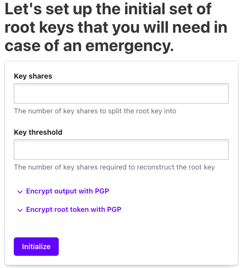
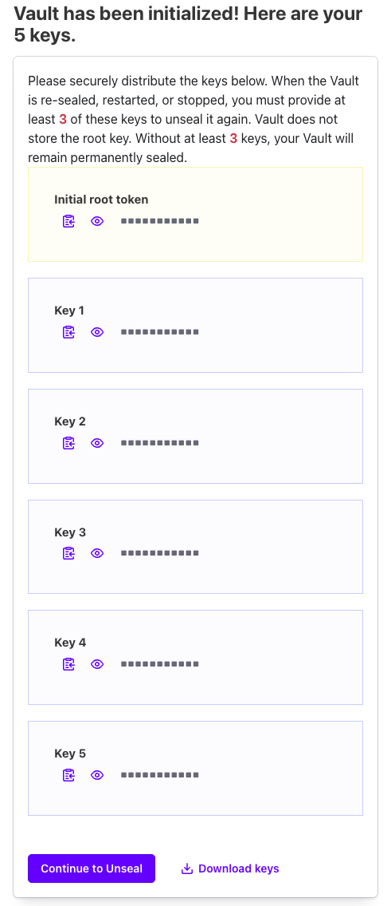
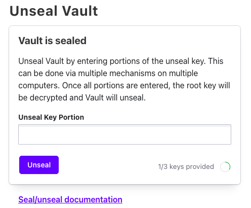
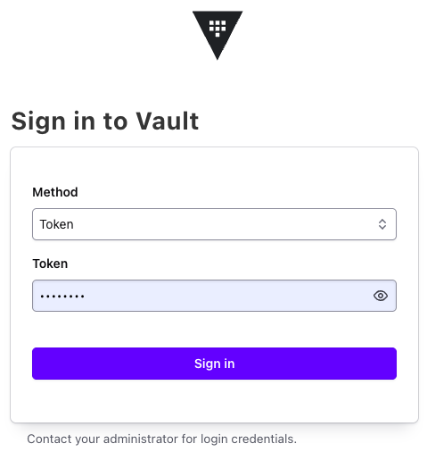
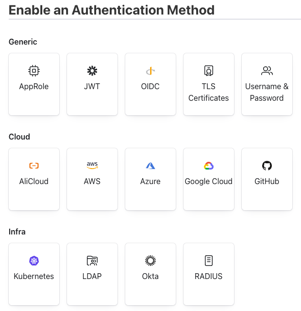
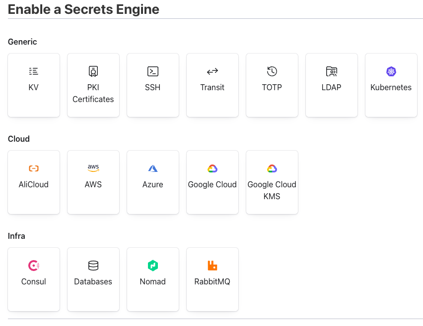

# HashiCorp Vault

## 1. Vault란?
- 민감 정보(API 키, 비밀번호, 인증서 등)를 중앙에서 안전하게 저장, 접근 제어, 관리를 자동화하는 강력한 오픈소스 도구.

### 1.1. Spring Cloud Config Server vs Vault
| 항목         | Spring Cloud Config Server                               | HashiCorp Vault                                                            |
|------------|----------------------------------------------------------|----------------------------------------------------------------------------|
| 주요 목적      | -분산 시스템의 설정 정보 중앙 관리<br/>-`일반 정보`                        | API 키, 암호, 인증서 등 `비밀 정보`의 안전한 저장 및 관리                                      |
| 핵심 기능      | - 프로필(dev, prod)별 설정 분리                                  | - 강력한 암호화 (저장, 전송)<br/>- 동적 비밀번호 생성 (DB, 클라우드)<br/>- 상세한 감사 로그 (Audit log) |
| 보안 수준      | 암호화 기능 제공 (대칭/비대칭 키)                                     | 보안에 특화됨. 훨씬 더 정교하고 강력한 보안 기능 제공                                            |
| 이상적인 사용 사례 | - 마이크로서비스 환경의 공통 설정 관리<br/>- 기능 플래그, 타임아웃 값 등 비민감성 정보 관리 | - 데이터베이스 계정 정보<br/>- 각종 인증서 및 토큰 관리                                        |


## 2. 특징
### 2.1. 중앙 집중식 보안 저장소 (Secure Secret Storage)
- 모든 민감 정보를 암호화하여 안전하게 한곳에 저장.
- 저장된 데이터는 암호화되어 있어 Vault 관리자조차 원본 내용을 볼 수 없음

### 2.2. 서비스로서의 암호화 (Encryption as a Service)
- 애플리케이션의 데이터를 Vault를 통해 암호화하고 복호화할 수 있는 기능을 제공.
- 개발자는 복잡한 암호화 로직을 직접 구현할 필요가 없음.

### 2.3. 강력한 접근 제어 및 감사 (Access Control & Auditing)
- 모든 접근은 토큰(Token) 기반으로 이루어지며, 정책(Policy)을 통해 어떤 사용자나 애플리케이션이 어떤 정보에 접근할 수 있는지 세밀하게 제어할 수 있음.
- 모든 요청과 응답은 상세한 감사 로그(Audit Log)로 기록되어 추적이 용이.

### 2.4. 다양한 인증 방식 지원 (Flexible Authentication)
- 사용자 이름/비밀번호, 토큰뿐만 아니라 AWS IAM, Kubernetes, LDAP 등 다양한 외부 시스템과의 연동을 통한 인증을 지원하여 유연한 인증 환경을 구축할 수 있음.

### 2.5. 동적 시크릿 (Dynamic Secrets)
- 필요할 때마다 임시로 사용할 수 있는 데이터베이스 계정, AWS 접근 키 등을 동적으로 생성.
- 사용이 끝나면 자동으로 파기되므로, 고정된 계정을 계속 사용하는 것보다 훨씬 안전하게 사용.

### 2.6. 리스 및 갱신 (Leasing and Renewal)
- Vault를 통해 발급된 모든 시크릿에는 유효기간(Lease)이 부여.
- 클라이언트는 유효기간이 만료되기 전에 갱신을 요청해야만 계속 사용할 수 있음.
- 시크릿이 유출되더라도 피해를 최소화할 수 있음.


## 3. 주요 개념/용어
| 용어                                             | 분류    | 설명                                 |
|------------------------------------------------|-------|------------------------------------|
| Seal Key                                       | 키     | 모든 데이터를 암호화하는데 사용되는 키              |
| Unseal Key                                     | 키     | 암호화된 데이터를 복호화하는데 사용되는 키            |
| Initial Root Key                               | 키     | 서버를 처음 설정할 때 생성되는 최상위 레벨 키         |
| Encryption key<br/>(protected by the root key) | 키     | 루트 키에 의해 보호되는 암호화 키                |
| Keyring                                        | 기능    | 여러 암호화 키를 안전하게 저장하고 관리하는 Vault의 기능 |
| Rekey                                          | 작업    | Unseal 키를 교체하는 작업을 의미              |
| Rotate                                         | 작업    | 내부에서 사용되는 암호화 키를 교체하는 작업을 의미       |
| `Secrets Engine`                               | 구성요소  | 비밀정보를 생성하고 관리하는 구성요소               |
| Secrets                                        | 데이터   | 보호하고 있는 비밀 데이터                     |
| `Authentication Method`                        | 구성요소  | 접근할 때 사용되는 인증 방식                   |
| `ACL(Access Control List) Policy`              | 구성요소  | 리소스에 대한 접근 권한을 관리하는 정책             |
| HCL File                                       | 파일 형식 | HashiCorp 제품에서 사용되는 설정 파일 형식       |


## 4. Install by Docker Compose
### 4.1. [valut](https://hub.docker.com/_/vault) vs [hashicorp/valut]()
- 두 이미지 모두 HashiCorp 사의 valut 이미지 임
  - `vault`: Docker Hub에서 공식적으로 제공되는 이미지
  - `hashicorp/vault`: HashiCorp가 관리하는 이미지
  > 최신 기능 제공과 업데이트를 더 자주하는 `hashicorp/valut` 사용 권장

### 4.2. [hashicorp/vault](compose.yml)
```docker
docker run --cap-add=IPC_LOCK \
  --name vault -d \
  -e 'VAULT_LOCAL_CONFIG={"storage": {"file": {"path": "/vault/file"}}, "listener": [{"tcp": { "address": "0.0.0.0:8200", "tls_disable": true}}], "default_lease_ttl": "168h", "max_lease_ttl": "720h", "ui": true}' \
  -p 8200:8200 hashicorp/vault:1.20 server
```

## 5. QuickStart
### 5.1. Init vault
- 브라우저로 http://127.0.0.1:8200 접속



- Key shares: 공유할 key 수
- Key threshold: threshold 수 만큼 입력해야 봉인/해제 시 사용



> ❗️ 반드시 다운로드 받아야 함

```json
{
  "keys": [
    "a4307a9815766c ... 9c3c91cc0936335",
    "7b8690d0db2a34 ... cbbdd6879428d53",
    "4ba576250cac7c ... ab8d231cb3ac8f1",
    "c6af50da2344f5 ... 02c05b068b631eb",
    "930dcefa3bec46 ... 4dbd1b9c156ecc8"
  ],
  "keys_base64": [
    "pDB6mBV2b ... nDyRzAk2M1",
    "e4aQ0NsqN ... y73Wh5Qo1T",
    "S6V2JQysf ... q40jHLOsjx",
    "xq9Q2iNE9 ... AsBbBotjHr",
    "kw3O+jvsR ... Tb0bnBVuzI"
  ],
  "root_token": "hvs.Ku ... vT26jp0fm"
}
```



- 다운로드 받은 파일의 keys 또는 base64된 keys 3회 입력



- `root_token`으로 로그인

### 5.2. Vault Cli 환경 변수 등록
- GUI로도 가능하나 일부 기능은 확인이 불가하여 CLI로 작업
```shell
$ docker exec -it vault sh

# VAULT_ADDR 미설정 시 `https://127.0.0.1:8200`으로 통신
/ # export VAULT_ADDR='http://127.0.0.1:8200'
/ # export VAULT_TOKEN='ROOT_TOKEN'
```

### 5.3. Enable an Authentication Method
- AppRole 인증 활성화
  - Token, ID/PW 외 다른 인증 방식 사용 권장
  - JWT/OIDC - IDP가 있거나 표준으로 JWT 사용 시



```shell
/ # vault auth enable approle
```

### 5.4. ACL Policies
#### 5.4.1. Hashicorp Configuration Language([HCL](https://github.com/hashicorp/hcl))
- FQDN(Fully Qualified Domain Name) 형식
```json5
// Grant 'create', 'read' , 'update', and ‘list’ permission
// to paths prefixed by 'secret/*'
path "secret/*" {
  capabilities = [ "create", "read", "update", "list" ]
}

// Even though we allowed secret/*, this line explicitly denies
// secret/super-secret. This takes precedence.
path "secret/super-secret" {
  capabilities = ["deny"]
}
```

#### 5.4.2. 정책 생성
- path 앞 `kv`는 `Secrets Engines` 중 `KV(Key/Value)`와 매핑되어 사용할 예정
```shell
/ # vault policy write tutorials-policy - <<EOF
path "kv/data/tutorials/*" {
  capabilities = ["read"]
}
EOF
```

#### 5.4.3. 파일로 작성
- 추후 정책 추가 시 용이
```shell
/ # echo 'path "kv/data/tutorials/*" { capabilities = ["read"] }' > tutorials-policy.hcl
/ # vault policy write tutorials-policy tutorials-policy.hcl
```

### 5.5. [Use AppRole authentication](https://developer.hashicorp.com/vault/docs/auth/approle)

#### 5.5.1. [Best practices for AppRole authentication](https://developer.hashicorp.com/vault/docs/auth/approle/approle-pattern)

#### 5.5.2. 역할 생성 및 정책 연결
```shell
/ # vault write auth/approle/role/tutorials-role \
    secret_id_num_uses=0 \
    secret_id_ttl=0 \
    token_num_uses=0 \
    token_ttl=20m \
    token_max_ttl=30m \
    policies="tutorials-policy"
```

#### 5.5.3. RoleId 조회
```shell
/ # vault read auth/approle/role/tutorials-role/role-id
```

#### 5.5.4. SecretID 발급
  - 발급 시마다 SecretId가 달라짐
```shell
/ # vault write -f auth/approle/role/tutorials-role/secret-id
```

### 5.6. Enabled Secrets Engines



#### 5.6.1. KV(Key/Value) 활성화
```shell
/ # vault secrets enable -path=kv/ -version=2 kv
```

#### 5.6.2. 암호화할 데이터 추가
```shell
/ # vault kv put kv/tutorials/local api-key=TUTORIAL-API-KEY
```

### 5.7. Enabled Secrets Engines : [DataBase](https://developer.hashicorp.com/vault/docs/secrets/databases/mysql-maria)
- Dynamic Secrets
```shell
/ # vault secrets enable database
```

#### 5.7.1. 접속 정보 설정
-  해당 계정은 다른 사용자를 생성할 수 있어야 함
```shell
/ # vault write database/config/mariadb-connection \
    plugin_name=mysql-database-plugin \
    connection_url="{{username}}:{{password}}@tcp(tutorials-mariadb:3306)/" \
    allowed_roles="tutorials-db-role" \
    username="root" \
    password="111111"
```

#### 5.7.2. 역할 생성
```shell
/ # vault write database/roles/tutorials-db-role \
    db_name=mariadb-connection \
    creation_statements="CREATE USER '{{name}}'@'%' IDENTIFIED BY '{{password}}'; GRANT SELECT,INSERT,UPDATE,DELETE ON tutorials.* TO '{{name}}'@'%';" \
    default_ttl="1h" \
    max_ttl="24h"
```

#### 5.7.3. 권한 추가
```shell
/ # echo 'path "database/creds/tutorials-db-role" { capabilities = ["read"] }' >> tutorials-policy.hcl

/ # vault policy write tutorials-policy tutorials-policy.hcl
```

#### 5.7.3. 권한 갱신
```shell
/ # vault write auth/approle/role/tutorials-role policies="tutorials-policy"
```

### 5.8. Enabled Secrets Engines : [Transit](https://developer.hashicorp.com/vault/docs/secrets/transit)
```shell
/ # vault secrets enable transit

// Allow encryption operations
/ # echo 'path "transit/encrypt/tutorials-key" { capabilities = ["create", "update"] }' >> tutorials-policy.hcl

// Allow decryption operations
/ # echo 'path "transit/decrypt/tutorials-key" { capabilities = ["create", "update"] }' >> tutorials-policy.hcl

// Allow rewrap operations
/ # echo 'path "transit/rewrap/tutorials-key" { capabilities = ["create", "update"] }' >> tutorials-policy.hcl

// Allow key rotation
/ # echo 'path "transit/keys/tutorials-key/rotate" { capabilities = ["create", "update"] }' >> tutorials-policy.hcl

/ # vault policy write tutorials-policy tutorials-policy.hcl

/ # vault write auth/approle/role/tutorials-role policies="tutorials-policy"
```

#### 5.8.1. Create encryption key
```shell
/ # vault write -f transit/keys/tutorials-key
<<<
Key                       Value
---                       -----
allow_plaintext_backup    false
auto_rotate_period        0s
deletion_allowed          false
derived                   false
exportable                false
imported_key              false
keys                      map[1:1760579663]
latest_version            1 # 현재 키 버전
min_available_version     0
min_decryption_version    1 # 복호화할 수 있는 최소 키 버전
min_encryption_version    0
name                      tutorials-key
supports_decryption       true
supports_derivation       true
supports_encryption       true
supports_signing          false
type                      aes256-gcm96 # 키 타입

/ # vault list transit/keys
```

#### 5.8.2. Usage
- 암호화
  ```shell
    / # vault write transit/encrypt/tutorials-key plaintext=$(echo "my secret data" | base64)
    <<<
    Key            Value
    ---            -----
    ciphertext     vault:v1:PLPmZ63X0dBvf7E45OEQUFbCDowNYymtVOfG9nXdF0Qp20N9B/GHKF9rlA==
    key_version    1
    ```
- 복호화
    ```shell
    / # vault write transit/decrypt/tutorials-key ciphertext=vault:v1:PLPmZ63X0dBvf7E45OEQUFbCDowNYymtVOfG9nXdF0Qp20N9B/GHKF9rlA==
    <<<
    Key          Value
    ---          -----
    plaintext    bXkgc2VjcmV0IGRhdGEK

    / # echo bXkgc2VjcmV0IGRhdGEK | base64 -d
    <<<
    my secret data
    ```
  
#### 5.8.3. Rotate
```shell
/ # vault write -f transit/keys/tutorials-key/rotate
<<<
Key                       Value
---                       -----
keys                      map[1:1760579663 2:1760580567]
latest_version            2 # 현재 버전 증가
min_available_version     0
min_decryption_version    1
min_encryption_version    0
name                      tutorials-key
type                      aes256-gcm9
```
- 다시 암/복호화 테스트
    ```shell
    / # vault write transit/encrypt/tutorials-key plaintext=$(echo "tutorials" | base64)
    <<<
    Key            Value
    ---            -----
    ciphertext     vault:v2:+DUvGfx6oeCsY2in2vDd8OBguEyc61bwcb4Hm7Xt5HDXxWM8LV8=
    key_version    2

    / # vault write transit/decrypt/tutorials-key ciphertext=vault:v2:+DUvGfx6oeCsY2in2vDd8OBguEyc61bwcb4Hm7Xt5HDXxWM8LV8=
    <<<
    Key          Value
    ---          -----
    plaintext    dHV0b3JpYWxzCg==

    / # echo dHV0b3JpYWxzCg== | base64 -d
    <<<
    tutorials
    ```

#### 5.8.4. Manage Key version
```shell
/ # vault write transit/keys/tutorials-key/config min_decryption_version=2
<<<
latest_version            2
min_available_version     0
min_decryption_version    2
min_encryption_version    0
name                      tutorials-key
```

- `v1`으로 복호화 시도 시 에러
```shell
/ # vault write transit/decrypt/tutorials-key ciphertext=vault:v1:PLPmZ63X0dBvf7E45OEQUFbCDowNYymtVOfG9nXdF0Qp20N9B/GHKF9rlA==
<<<
Error writing data to transit/decrypt/tutorials-key: Error making API request.
                                                                                                                                                                                                                                                                                                                        
URL: PUT http://127.0.0.1:8200/v1/transit/decrypt/tutorials-key                                                                                                                                                                                                                                                         
Code: 400. Errors:                                                                                                                                                                                                                                                                                                      
                                                                                                                                                                                                                                                                                                                        
* ciphertext or signature version is disallowed by policy (too old)
```

#### 5.8.5. Rewrap
- 이전 버의 데이터를 새로운 키로 재 암호화
```shell
/ # vault write transit/rewrap/tutorials-key ciphertext=vault:v1:PLPmZ63X0dBvf7E45OEQUFbCDowNYymtVOfG9nXdF0Qp20N9B/GHKF9rlA==
<<<
Key            Value
---            -----
ciphertext     vault:v2:sHZj3NM4Okt8Uj0WZCXwgr+Po6eTxjr+cpi59qoMnbIEEsKV1DsghZ9Qxg==
key_version    2
```

## 6. Error
### 6.1. `Code: 503. Errors: * Vault is sealed` 발생 시
- 다운로드 받은 key로 Unseal(봉인 해제) 후 사용 가능
```shell
/ # vault operator unseal
Unseal Key (will be hidden):
```

### 6.2. 권한 회수(Application shutdown) 시 403 Forbidden
```text
403 Forbidden on PUT request for "http://localhost:8200/v1/sys/leases/revoke": "{"errors":["1 error occurred:\n\t* permission denied\n\n"]}<EOL>"
```
#### 6.2.1. 권한 추가
```shell
/ # echo 'path "sys/leases/revoke" { capabilities = ["update"] }' >> tutorials-policy.hcl

/ # vault policy write tutorials-policy tutorials-policy.hcl
```

#### 6.2.2. 권한 갱신
```shell
/ # vault write auth/approle/role/tutorials-role policies="tutorials-policy"
```

#### 6.2.3. 접속한 DB 사용자 확인 시 `root`로 접속하는 경우
- DB(MariaDB) 사용자는 추가 되었으나 DataSource는 root로 접속
- Spring Bean 로딩/초기화 이슈로 Vault 연동이 Bean 생성 시점 이후에 됨
- [DataSourceConfig](src/main/kotlin/tutorials/vault/config/DataSourceConfig.kt) 처럼 `@DependsOn("vaultTemplate")` 해줘야 함


## 7. Other Secrets Engines
### 7.1. [Transit](https://velog.io/@gweowe/Vault-transit%EC%9D%84-%ED%99%9C%EC%9A%A9%ED%95%9C-Data-%EC%95%94%ED%98%B8%ED%99%94-Ubuntu)
### 7.2. [PKI Certificates](https://www.baeldung.com/spring-boot-hashicorp-valut-reload-ssl-certificates)

## 참조
- [Vault 이해하기 -1 : 이론, 구성요소, 처리과정](https://adjh54.tistory.com/475#1.%20Vault%EC%9D%98%20%ED%8A%B9%EC%A7%95-1-1)
